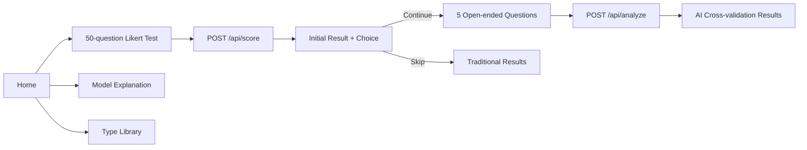

# MBTI Project Architecture

This app is a standalone MBTI-style personality test in the personal monorepo. It intentionally stays dependency-light:

- Frontend: single-file HTML at `mbti/index.html` using Tailwind CDN plus local CSS and vanilla JavaScript.
- Backend: Python stdlib HTTP server at `mbti/server.py`.
- Data: `mbti/questions.json` contains Likert questions, open-ended question pool, dimension labels, and type profiles.

## User Flow



## Frontend Modules

`index.html` is still one deployable file, but the JavaScript is organized around a small state model:

- `S`: route, loaded question data, Likert answers, current page, traditional result, open-ended answers, AI result.
- `load()`: fetches `/api/questions` once and renders static model metadata.
- `go(route)`: switches screens and updates navigation state.
- `renderPage(page)`: renders paginated Likert questions, five per page.
- `submitTraditional()`: posts answers to `/api/score` and moves to the bridge screen.
- `renderOpen(index)`: renders one open-ended question and saves drafts locally.
- `submitOpen()`: posts open answers to `/api/analyze`; falls back to a local fallback block if AI is unreachable.
- `renderResults(hasAI)`: renders the result page from either traditional-only data or AI analysis.
- `showLibrary()` / `openType(type)`: renders the type library and modal.

## Visual System

The design keeps the original homepage direction: warm paper background, green/violet accents, soft cards, and a polished first viewport. The later screens now use the same system:

- One app shell/navigation pattern.
- One button vocabulary: primary gradient, secondary outlined, decision cards.
- One card vocabulary: soft cards for sections, solid cards for focused input.
- One progress pattern for Likert and open-ended flows.
- One result layout: type summary + dimension coordinates on the left, interpretation stack on the right.

## Backend API

### GET /api/questions

Returns all questionnaire data from `questions.json`.

### POST /api/score

Input:

```json
{ "answers": [{ "id": 1, "value": 1 }] }
```

Output includes:

- `type`: four-letter MBTI type.
- `identity`: A/T identity dimension.
- `details`: per-dimension score details.
- `selected_questions`: five open-ended questions selected by uncertainty/shadow probing.

### POST /api/analyze

Input includes traditional result details plus open-ended answers. Output is expected to be JSON with insight, confidence, dimension analysis, strengths, growth areas, and career hints. The server already has fallback behavior when the configured AI backend is unavailable.

## Local Run

```powershell
python mbti/server.py --host 127.0.0.1 --port 8899
```

Then open http://127.0.0.1:8899/.

## Validation

Current lightweight checks:

```powershell
python -c "import json, ast; json.load(open('mbti/questions.json', encoding='utf-8')); ast.parse(open('mbti/server.py', encoding='utf-8').read())"
node -e "const fs=require('fs'); const s=fs.readFileSync('mbti/index.html','utf8'); const js=s.slice(s.indexOf('<script>')+8,s.lastIndexOf('</script>')); new Function(js); console.log('JS ok')"
```
